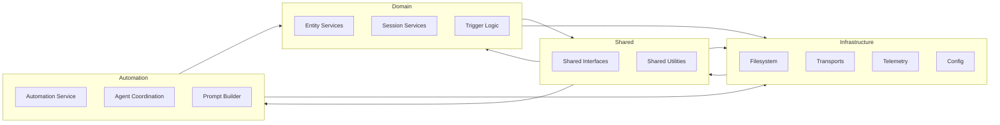

# Architecture Overview (Workstream A)

This draft captures the target modular boundaries for the refactor effort. It mirrors the current `src/` layout but reframes responsibilities into three primary layers: automation, domain, and infrastructure. All refactored modules will live under `refactoring/` while we iterate.

## Layered Model

```mermaid
flowchart TB
    UI["UI & Entry Points\n(e.g. launch_rp_tui, scripts)"] --> Automation[
        "Automation Layer\n(Orchestration, pipelines, services)"
    ]
    Automation --> Domain[
        "Domain Layer\n(Entity + Session logic)"
    ]
    Automation --> Infrastructure[
        "Infrastructure Layer\n(File system, transports, config)"
    ]
    Domain --> Infrastructure
```

- UI interacts only with the automation facades.
- Automation orchestrates high-level workflows and delegates business rules to the domain layer.
- Domain encapsulates entity/session knowledge and calls infrastructure through injected interfaces.
- Infrastructure provides adapters for filesystem, transports, telemetry, and configuration.

## Target Module Map (Refactor Folder)

```text
refactoring/
  docs/
    architecture/
      README.md (this file)
    ...
  src/
    automation/
    domain/
      entities/
      sessions/
    infrastructure/
      filesystem/
      transports/
      config/
      telemetry/
    shared/
      interfaces/
      utils/
```

- `automation/`: replaces `src/automation` facades (`AutomationService`, orchestrators, prompt assembly).
- `domain/`: hosts `EntityService`, `SessionManager`, trigger logic, parsers, repositories.
- `infrastructure/`: supplies `FileWriteQueue`, transports, logging facade, configuration loaders.
- `shared/`: cross-cutting contracts (protocols/interfaces), small utilities that obey dependency rules.

## Dependency Rules



- Only `shared/` may be imported across layers without restriction.
- Automation may call domain and infrastructure, but not vice versa.
- Domain may depend on infrastructure abstractions, never on automation implementations.
- Infrastructure must not import from automation or domain; adapters expose interfaces consumed upward.

## Current vs Target Mapping Notes

- `src/automation` maps to `refactoring/src/automation` with clarified services (`AutomationService`, `AgentRunner`, `PromptTemplateManager`).
- `src/entity_manager.py`, `src/session_manager.py`, and `src/trigger_system/` feed into `refactoring/src/domain`.
- `src/file_manager.py`, `src/fs_write_queue.py`, `src/clients/`, `src/utils/`, `src/core/telemetry` inform `refactoring/src/infrastructure`.
- Shared cross-layer helpers (logging facade, config protocols) migrate into `refactoring/src/shared`.

## Next Steps for Workstream A

1. Draft module-level README files under each refactor layer describing responsibilities.
2. Introduce Python protocols/interfaces for logging, config, and transports under `refactoring/src/shared/interfaces/`.
3. Prepare import-audit tooling to flag violations against the dependency rules above.
4. Update this document with decisions, diagrams, and test coverage expectations as modules land.

## Completion Status

**10 of 11 Workstreams Complete (91%)**

- ✅ **Workstream A**: Architecture & Boundaries - Foundation, shared interfaces, dependency rules
- ✅ **Workstream B**: Session State Management - SessionManager, state transitions, checkpoints
- ✅ **Workstream C**: Entity Domain - EntityService, Repository, Parser, Preferences (78 tests)
- ✅ **Workstream D**: Automation Pipeline - AutomationService, Factory, Prompt building (52 tests)
- ✅ **Workstream E**: File Access Service - Tiered loading, bundles, metadata (35 tests)
- ✅ **Workstream F**: Triggers & Templates - TriggerCoordinator, NarrativeTemplateManager (80 tests)
- ✅ **Workstream G**: Session Management (Testing) - 39 tests passing
- ✅ **Workstream H**: Agent System - Strategies, coordination, execution (24 tests)
- ✅ **Workstream I**: Clients & Transport - Multi-provider LLM support, transport abstraction (42 tests)
- ✅ **Workstream J**: Configuration & Defaults - 4-layer config system, validation (26 tests)
- ✅ **Workstream K**: Testing & Tooling - Ruff, Black, Mypy, Pytest, fixtures, scripts
- ⏳ **Workstream L**: Documentation & Change Management - In Progress

**Total Test Count**: 376+ tests passing across all workstreams

## Change Log

- 2025-10-21: **Workstreams J & K Complete** - Configuration system with 4-layer precedence and comprehensive tooling infrastructure. Documentation & migration guides in progress (Workstream L).
- 2025-10-20: **Workstreams C, G, H, I Complete** - Entity domain refactored with multi-provider preference generation, session management tests complete, agent system implemented, LLM client abstraction with transport layer complete. Total 209+ tests passing.
- 2025-10-20: **Workstreams D & F Complete** - Automation pipeline (factory, services, agents, prompt building) and trigger/template systems fully implemented with 209 tests passing. Dependency rules validated; resolved circular import by moving `EntityType` to `shared/models.py` per architecture design. All layers working as designed.
- 2025-10-18: Initial Workstream A architecture draft created with layered diagrams and dependency rules.
